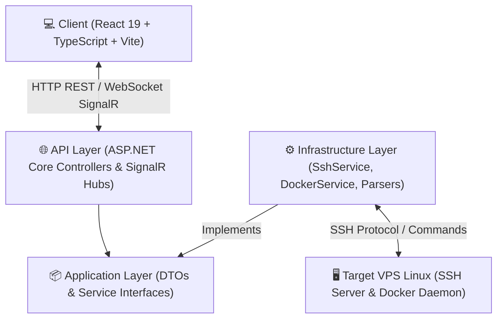

# 🚀 VPS Manager (MVM - My VPS Manager)

<p align="center">
  
  
  
  
  
  
  
</p>

<p align="center">
  <b>Hệ thống Quản lý, Giám sát & Điều khiển Máy chủ Linux (VPS) Trực quan Thời gian thực không cần Agent (Agentless Management Dashboard).</b>
</p>

---

## 📸 2. Screenshots / Demo

```text
┌─────────────────────────────────────────────────────────────────────────────────────────┐
│ 🖥️ VPS Manager Dashboard                                    [Online: 192.168.1.100] [⚙️]│
├───────────────┬─────────────────────────────────────────────────────────────────────────┤
│ 📌 Overview   │ 📊 SYSTEM METRICS                                                       │
│ 🔑 SSH Config │ ┌─────────────┐ ┌─────────────┐ ┌─────────────┐ ┌─────────────┐         │
│ 📈 Metrics    │ │ CPU: 12%    │ │ RAM: 4.2GB  │ │ Disk: 45%   │ │ Network:    │         │
│ 💻 Terminal   │ │ [||||     ] │ │ (65% used)  │ │ (45GB/100GB)│ │ 1.2MB/s In  │         │
│ 🐳 Docker     │ └─────────────┘ └─────────────┘ └─────────────┘ └─────────────┘         │
│ ⚙️ Services   │                                                                         │
│ 🛡️ Logs & Audit│ 🐳 DOCKER CONTAINERS (Running: 4 | Stopped: 1)                           │
│               │ ├─ nginx-proxy     [Running] [Ports: 80, 443]  [Logs] [Restart] [Stop]  │
│               │ ├─ postgres-db     [Running] [Ports: 5432]     [Logs] [Restart] [Stop]  │
│               │ └─ redis-cache     [Running] [Ports: 6379]     [Logs] [Restart] [Stop]  │
└───────────────┴─────────────────────────────────────────────────────────────────────────┘
```


---

## 🌐 3. Overview

**VPS Manager (MVM)** là một nền tảng quản trị Web tập trung dành cho các nhà phát triển và quản trị viên hệ thống. Ứng dụng giải quyết bài toán quản lý đồng thời nhiều máy chủ Linux (VPS) từ xa với nguyên tắc **Agentless** (Không cần cài đặt bất kỳ phần mềm agent hay daemon nào lên máy chủ mục tiêu, chỉ cần kết nối thông qua giao thức SSH tiêu chuẩn).

Ứng dụng kết hợp sức mạnh của **.NET 9 Web API + SignalR** ở phía Server và **React 19 + TypeScript + Xterm.js** ở phía Client để mang lại trải nghiệm điều khiển thời gian thực mượt mà như đang sử dụng ứng dụng native desktop.

---

## ❓ 4. Why VPS Manager?

- ❌ **Không cần nhớ hàng chục dòng lệnh SSH phức tạp**: Không phải gõ lại `top`, `free -m`, `df -h`, `docker ps`, `journalctl -u...` mỗi khi kiểm tra máy chủ.
- ⚡ **Agentless & Nhẹ nhàng**: Không làm tốn tài nguyên CPU/RAM của VPS mục tiêu vì không chạy dịch vụ ngầm (daemon/agent) trên VPS.
- 🛡️ **An toàn & Riêng tư**: Lưu trữ cấu hình SSH trực tiếp trên trình duyệt cá nhân (LocalStorage), không lưu mật khẩu hay SSH key lên các hạ tầng đám mây bên thứ ba.
- 💻 **Tích hợp Web Terminal thời gian thực**: Truy cập dòng lệnh trực tiếp ngay trên trình duyệt mà không cần cài phần mềm thứ ba như PuTTY hay MobaXterm.
- 🔍 **Cảnh báo an ninh SSH tự động**: Tự động phát hiện các đợt tấn công Brute-force SSH và cảnh báo địa chỉ IP độc hại.

---

## ✨ 5. Key Features

### 🏢 Quản Lý Đa VPS (Multi-VPS Profiles)
- Thêm, sửa, xóa không giới hạn các hồ sơ VPS.
- Hỗ trợ xác thực qua **Password** hoặc **SSH Key (RSA, Ed25519)** có hoặc không có Passphrase.
- Kiểm tra trạng thái kết nối SSH (Live SSH Health Check).

### 📊 Giám Sát Tài Nguyên Hệ Thống (Real-time Metrics)
- Theo dõi chỉ số CPU, RAM, Disk (Root & Partitions), Network Traffic (In/Out KB/s).
- Xem thông tin OS (Distribution, Kernel version, Architecture, Uptime).
- Biểu đồ biến động tài nguyên theo thời gian thực (hỗ trợ Auto Refresh 5s, 10s, 30s).

### 💻 Web SSH Terminal Thời Gian Thực (SignalR + Xterm.js)
- Trình giả lập Terminal chuẩn Linux đầy đủ màu sắc ANSI.
- Hỗ trợ resize kích thước PTY linh hoạt theo màn hình trình duyệt.
- Tự động dọn dẹp và ngắt kết nối SSH Session an toàn khi đóng tab/WebSockets.

### 🐳 Quản Lý Docker & Docker Compose Nâng Cao
- **Overview**: Thống kê Containers, Images, Volumes, Networks.
- **Container Control**: Start, Stop, Restart, Pause, Unpause, Remove.
- **Container Logs Viewer**: Đọc log thời gian thực với tùy chọn số dòng (tail).
- **Docker Compose Discovery**: Tự động tìm kiếm các dự án `docker-compose.yml` trên VPS.
- **Compose Stack Action**: Chạy `up -d`, `down`, `restart`, `build` 1-click.
- **Compose Editor**: Trình xem và chỉnh sửa file `docker-compose.yml` trực tiếp trên Web UI.
- **System Prune**: Dọn dẹp Volume rác và tài nguyên Docker dư thừa.

### ⚙️ Giám Sát Dịch Vụ Hệ Thống (System Services)
- Theo dõi trạng thái (Active/Inactive) của Nginx, Docker, SSH, MySQL, PostgreSQL, Redis, UFW, Cron.

### 🛡️ Nhật Ký & Kiểm Tra An Ninh SSH (Logs & Security Audit)
- Đọc log hệ thống từ `/var/log` và `journalctl` với bộ lọc nâng cao.
- **SSH Audit Scanner**: Bóc tách log đăng nhập SSH, nhận diện các lượt đăng nhập **Thành công** / **Thất bại** và tự động phát hiện các IP thực hiện tấn công dò mật khẩu (Brute-force Attack).

---

## 🏗️ 6. Architecture

Dự án áp dụng mô hình **Clean Architecture** (Onion Architecture) cho Backend .NET 9 và kiến trúc Component-driven cho Frontend React 19:



---

## 🔄 7. How It Works

1. **Kết nối SSH non-persistent REST & Persistent SignalR**:
   - Các tác vụ như lấy thông tin hệ thống, danh sách container, log file sử dụng REST API ngắn hạn qua `Renci.SshNet`.
   - Riêng **Web Terminal** duy trì một SSH Interactive Shell Stream kết nối trực tiếp với **SignalR WebSocket Hub** để đẩy nhận dữ liệu gõ phím & hiển thị màu tức thì.
2. **Parser dữ liệu Linux**:
   - Backend thực thi các lệnh chuẩn Linux (`top -bn1`, `free -m`, `df -h`, `docker ps`, `journalctl`, `cat /var/log/auth.log`).
   - Các parser chuyên dụng (`LinuxSystemInfoParser`, `SshAuditService`) bóc tách chuỗi thô thành dữ liệu DTO có cấu trúc trả về cho Frontend.
3. **Quản lý cấu hình phía Client**:
   - Mọi SSH Profile được đồng bộ cục bộ ở `localStorage` của trình duyệt người dùng, đảm bảo tính riêng tư.

---

## 🔒 8. Security

- 🔑 **No Cloud Credential Storage**: Mật khẩu và SSH Private Key hoàn toàn nằm ở máy tính của người dùng (LocalStorage).
- 🛡️ **SignalR Session Cleanup**: Khi client ngắt kết nối WebSocket, Backend lập tức kill SSH Shell Stream để tránh treo session ẩn trên VPS.
- 🚨 **SSH Security Audit**: Tự động phát hiện địa chỉ IP nghi vấn tấn công Brute-force SSH và thống kê chi tiết số lượt thử sai.
- 🌐 **CORS Controlled**: Cấu hình CORS chặt chẽ cho phép các origin được phê duyệt giao tiếp với Backend API.

---

## 🛠️ 9. Tech Stack

| Thành Phần | Công Nghệ / Thư Viện | Mô Tả |
| :--- | :--- | :--- |
| **Backend Framework** | .NET 9.0 (ASP.NET Core) | Web API hiệu năng cao |
| **Real-time Protocol** | ASP.NET Core SignalR | WebSocket giao tiếp Web Terminal |
| **SSH Client** | `Renci.SshNet` | Thư viện điều khiển SSH / Shell execution |
| **Unit Testing** | xUnit | Kiểm thử tự động các bộ Parser |
| **Frontend Framework**| React 19 + TypeScript | UI Library hiện đại |
| **Build Tool** | Vite 6.0 | Bundler siêu nhanh |
| **Styling** | Tailwind CSS v4 + Lucide Icons | UI/UX responsive & dark mode |
| **Web Terminal** | `@xterm/xterm` + `@xterm/addon-fit` | Giả lập Terminal chuẩn ANSI |
| **Charts** | Recharts | Biểu đồ giám sát CPU/RAM/Disk/Network |

---

## 📂 10. Project Structure

```text
my_vps_manager/
├── client/                              # Ung dung Frontend (React + Vite)
│   ├── src/
│   │   ├── components/                  # UI Components & Tabs
│   │   │   ├── dashboard/               # Overview, SshConfig, Metrics, Terminal, Docker, Services, Logs
│   │   │   ├── layout/                  # Header, Sidebar
│   │   │   └── ui/                      # Base UI Components (Button, Card, Badge...)
│   │   ├── services/                    # API Integration (vpsApi, dockerApi, logsApi)
│   │   ├── types/                       # TypeScript Types & Interfaces
│   │   ├── App.tsx                      # Component goc
│   │   └── main.tsx                     # Entrypoint
│   └── package.json
│
├── server/                              # Ung dung Backend (.NET 9)
│   ├── src/
│   │   ├── serverMVM.Api/               # Controllers, SignalR Hubs, Program.cs
│   │   ├── serverMVM.Application/       # DTOs & Service Interfaces
│   │   ├── serverMVM.Domain/            # Core Entities & Value Objects
│   │   └── serverMVM.Infrastructure/    # Services, Parsers, SSH logic
│   └── tests/
│       └── serverMVM.Infrastructure.Tests/ # Unit Tests (xUnit)
└── README.md
```

---

## 💻 11. Installation

### Tiền đề
- **Node.js**: `v18.0` trở lên
- **.NET SDK**: `v9.0` trở lên

### Bước 1: Clone dự án
```bash
git clone https://github.com/your-repo/my_vps_manager.git
cd my_vps_manager
```

### Bước 2: Khởi chạy Backend Server (.NET 9)
```bash
cd server/src/serverMVM.Api
dotnet run
```
> Backend API chạy mặc định tại: `http://localhost:5141`

### Bước 3: Khởi chạy Frontend Client (React 19)
```bash
cd client
npm install
npm run dev
```
> Trình duyệt sẽ mở tại: `http://localhost:5173`

---

## ⚙️ 12. Configuration

### Backend (`appsettings.json`)
```json
{
  "Logging": {
    "LogLevel": {
      "Default": "Information",
      "Microsoft.AspNetCore": "Warning"
    }
  },
  "AllowedHosts": "*"
}
```

### LocalStorage Keys (Client)
- `vps_manager_profiles_v2`: Danh sách thông tin VPS đã lưu.
- `vps_manager_active_id_v2`: ID của VPS đang được chọn xem.

---

## 🧪 13. Testing

Chạy toàn bộ bộ kiểm thử tự động cho Backend Parser:

```bash
cd server
dotnet test
```

Các test case bao gồm kiểm tra tính chính xác khi bóc tách thông tin CPU/RAM/Disk từ các câu lệnh Linux (`LinuxSystemInfoParserTests.cs`).

---

## 🗺️ 14. Roadmap

- [x] Quản lý đa hồ sơ VPS.
- [x] Giám sát thông số thời gian thực (CPU, RAM, Disk, Network).
- [x] Web SSH Terminal thời gian thực (SignalR + Xterm.js).
- [x] Quản lý Docker Containers & Docker Compose Stacks.
- [x] Trình bóc tách Log hệ thống & Cảnh báo an ninh IP SSH Brute-force.
- [ ] SFTP File Manager (Quản lý file trên VPS đồ họa).
- [ ] Quản lý Tường lửa UFW.

---

## ⚠️ 15. Known Limitations

- **Phụ thuộc vào các lệnh chuẩn Linux**: VPS mục tiêu cần là hệ điều hành Linux dựa trên Debian/Ubuntu/CentOS/RHEL hỗ trợ các lệnh tiêu chuẩn (`top`, `free`, `df`, `journalctl`, `docker`).
- **Phụ thuộc vào SSH Access**: Cần cổng SSH (mặc định 22) của VPS mở và cho phép truy cập từ máy chạy Backend Server.

---

## 🔮 16. Future Improvements

- 🔔 **Cảnh báo qua Telegram / Discord Webhook**: Gửi tin nhắn tự động khi tài nguyên VPS quá tải hoặc phát hiện IP liên tục tấn công SSH.
- 📁 **Quản lý Tệp SFTP**: Cho phép xem cây thư mục, upload/download và chỉnh sửa file đồ họa trực quan.
- 🛡️ **Mã hóa dữ liệu Server-side**: Tùy chọn lưu trữ credential mã hóa ở phía Server Database (EF Core / SQLite / PostgreSQL).

---

## 📄 17. License

Dự án được phân phối dưới giấy phép **MIT License**. Xem chi tiết tại file [LICENSE](LICENSE) (nếu có).

---

## 👤 18. Author

- **Project Lead & Developer**: Đội ngũ Phát triển VPS Manager (MVM)
- **Repository**: [my_vps_manager](file:///home/kyanh/workspace/Projects/my_vps_manager)
